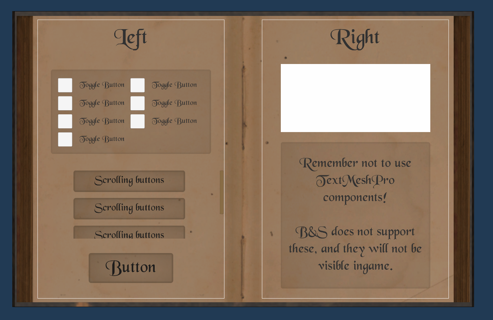
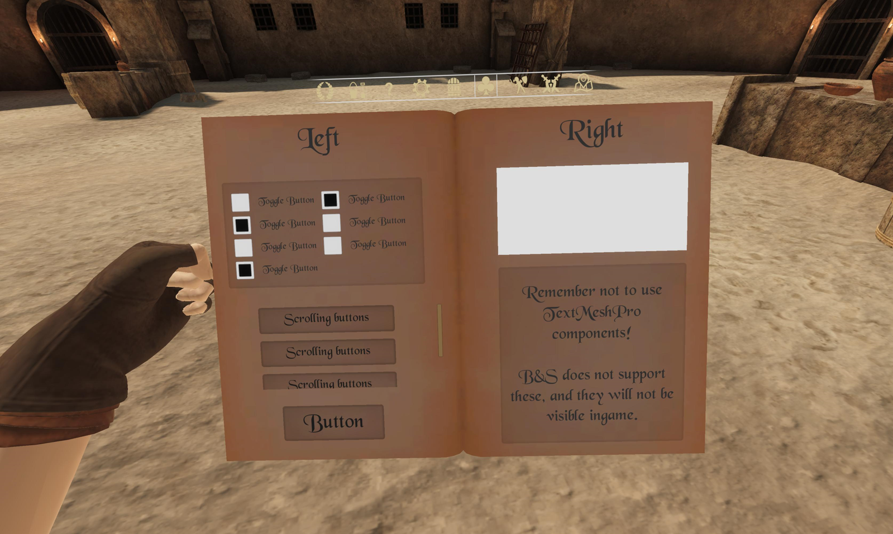

# Blade & Sorcery Menu Prefab

## This package includes:

- A correctly-scaled template menu, featuring a few common UI elements.
- A UI prefab environment that includes a book model you can use to preview how your menu will look while you're working.
- An example mod folder featuring the required JSON setup for adding your menu to the game.

---
## Preview:

### Editor Prefab Scene

### Ingame Menu

