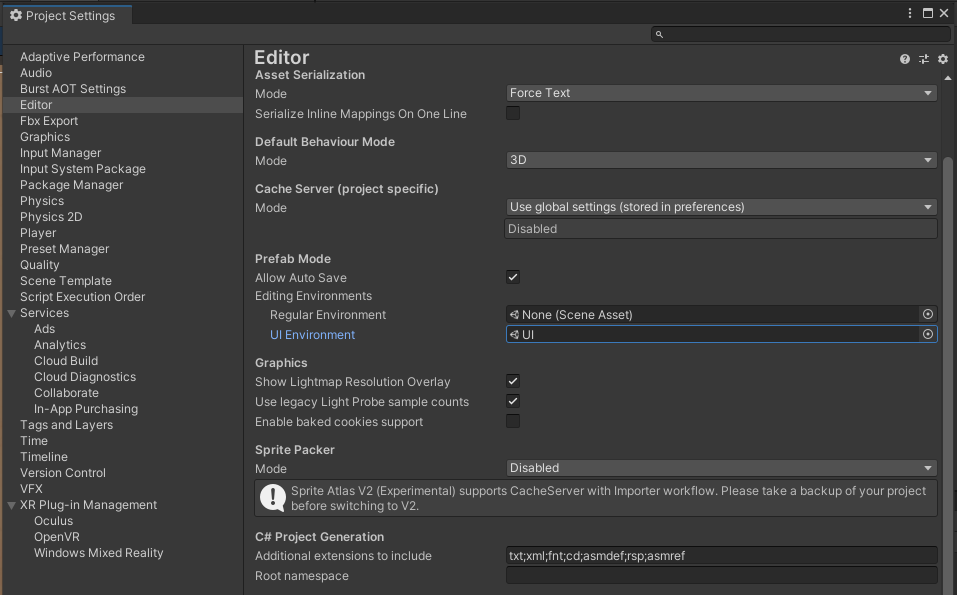

# Blade & Sorcery Menu Prefab

## This package includes:

- A correctly-scaled template menu, featuring a few common UI elements.
- A UI prefab environment featuring a book model to help preview how your menu will look.
- An example mod folder featuring the required JSON setup for adding your menu to the game.

---
## Preview:

### Editor Prefab Scene

### Ingame Menu

---

## Setting up the UI Environment

You can set the UI scene as your prefab environment by dragging it into the "UI Envrionment" field in your Project's editor settings:

